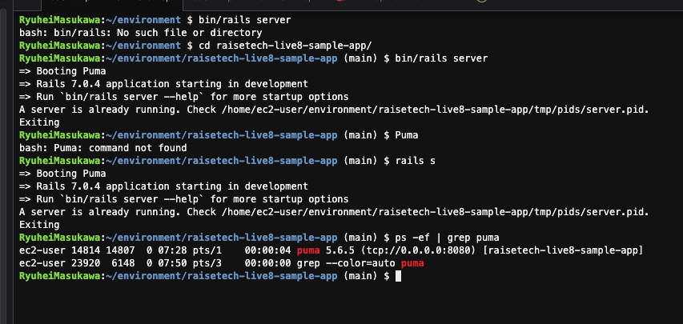
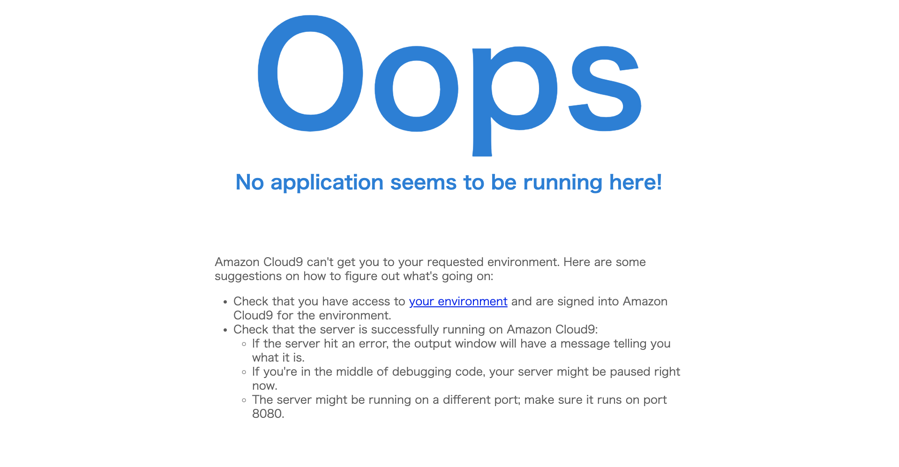
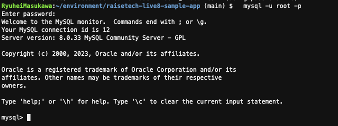
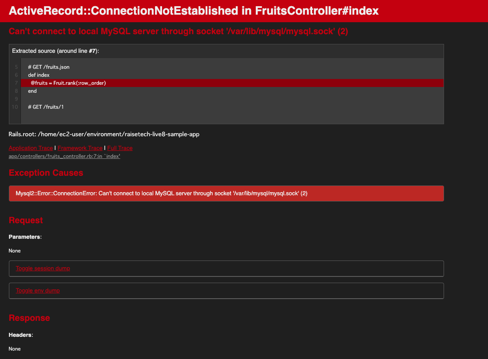

### AP サーバーの名前とバージョンを確認してみましょう。
puma 5.6.5

### AP サーバーを終了させた場合、引き続きアクセスできますか？結果を確認して、また AP サーバーを起動してください。
アクセスできません

### サンプルアプリケーションで使った DB サーバー（DB エンジン）の名前と、今 Cloud9 で動作しているバージョンはいくつか確認してみましょう。
mysql 8.0.33

### DB サーバーを終了させた場合、引き続きアクセスできますか？
できません

### Rails の構成管理ツールの名前は何でしたか？確認してみてください。
Bundler

### 今回の課題から学んだことを報告してください。
APサーバーとDBサーバーどちらも起動していないとエラーでアプリケーションが起動できないこと。
railsのAPサーバーにはpumaやUnicornが使われることが多いこと。
